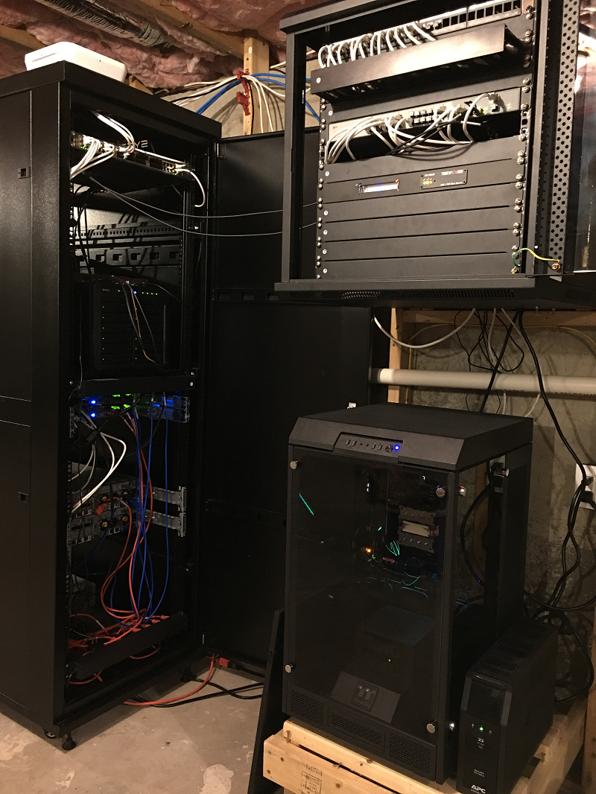

# Home Ops

## Overview

This repository contains configurations, resources, and scripts used to build-out my home environment in a GitOps-based manner.

## Documentation

For detailed information regarding my environments and everything in this repository, see the [Table of Contents](docs/00-table-of-contents.md) located in the docs folder.

## Directory layout

```sh
📂 home-ops
├─📁 .archive       # Old files I keep around for reference purposes
├─📁 .ci            # Continuous Integration (CI) tooling configurations
├─📁 .github        # GitHub Workflow and template items
├─📁 .taskfiles     # This repo uses Taskfiles vs. Makefiles (see https://taskfile.dev)
├─📁 .vscode        # Recommended extensions and settings for this repo
├─📁 assets         # Random assets used in repo documentation / charts / graphs
├─📁 docker         # Docker Compose files used for a local Container Registry and Pull-through-caches
├─📁 docs           # Folder containing detailed documentation about this repository
├─📁 flux           # Flux kustomizations used to automatically deploy Kubernetes resources / applications
├─📁 pki            # Holds Profiles and Templates used with cfssl toolkit to generate self-signed PKI
├─📁 scripts        # Shell scripts used to aid Taskfiles, some Tasks weren't expressive/scriptable enough
├─📁 talos-linux    # Patch files used when generating control-plane and worker configurations for Talos
├─📁 terraform      # Terraform files to provision Cloudflare DNS and Azure / Oracle cloud accounts
└─📁 windows-dsc    # PowerShell DSC related scripts to provision a local Hyper-V Talos Lab
```

See each sub-directory for an additional `README.md` that describes each area in greater detail.

## Pretty picture



## Inspired by

* https://github.com/onedr0p/home-ops
* https://github.com/bjw-s/home-ops
* https://github.com/JJGadgets/Biohazard
* https://github.com/toboshii/home-ops
* https://k8s-at-home.com/
