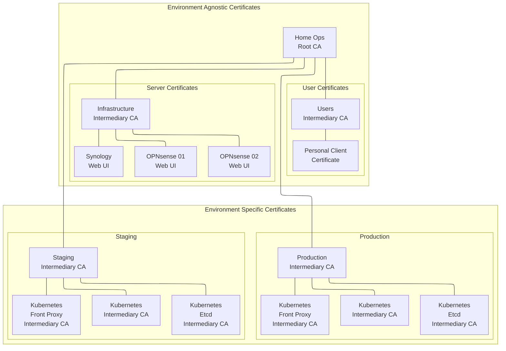

# PKI

This repository uses the CloudFlare `cfssl` tools written in Go. (*Fun fact*: The [LetsEncrypt](https://letsencrypt.org/) servers literally use the cfssl tools on their back-end to handle CSRs and CRLs).

I currently have my certificates split-up into two major categories named **Environment Agnostic** and **Environment Specific**.

Environment _Agnostic_ certificates handle common/shared things, as well as the Root CA. This separation also helps on devices like my OPNsense firewalls, where there isn't a concept of an "environment"...they're "just part of my core infrastructure" that helps to prepare / prop-up the eventual environments.

Environment _Specific_ certificates handle anything that lives within the boundaries of my Staging or Production environments _(mainly just Kubernetes-related resources at the moment)_.

## Table of Contents

* [Determine how you're going to handle your Root CA (important, seriously read this!!!)](#root-ca-handling)
* [Determine how many Intermediary CAs you want](#determine-intermediaries)
* [Example of my Home Ops PKI](#example)
* [Kubernetes Certificates](#kubernetes-certificates)
  * [Certificates Generated](#certificates-generated)
* [References](#references)

## <a id="root-ca-handling"></a>Determine how you're going to handle your Root CA (important, seriously read this!!!)

Part of the process that follows will leave you with Certificate Authority (CA) Root Key and CSR file assets. IT IS MANDATORY THAT YOU KEEP THESE SECURE AND/OR OFFLINE THEM FULLY WHEN DONE WITH THIS PROCESS!!! I cannot stress this step enough!!! If you fail on this step, and someone gets hold of these files, your security is literally worthless!!! It would be like literally handing an advesary the keys to your house! This also means, DO NOT PERFORM THIS ON A SYSTEM YOU BELIEVE MAY BE COMPROMISED IN EVEN THE LEAST BIT!

## <a id="determine-intermediaries"></a>Determine how many Intermediary CAs you want

Since you need to offline the CA Root Key and CSR, you'll want to create at least one Intermediary CA that you can cut your daily-use certificates from; otherwise, you would always have to bring the Root CA online and risk someone compromising it. Think about functional boundaries, device types, what certificates will be in-play, etc. Some example Intermediate CAs I've built-out are:

* Administration (Web Admin UI SSL, SSH+TLS for remote management, etc.)
* Logging (syslog-ng w/ TLS)
* Services Communication
* Proxies (HTTPS through nginx)

## <a id="example"></a>Example of my Home Ops PKI



## Taskfile Steps Example

```shell
task prepare-home-ops-root-ca
task prepare-home-ops-intermediary-cas
task prepare-infrastructure-server-certs
task prepare-infrastructure-user-certs
task prepare-environment-specific-pki
```

## <a id="kubernetes-certificates"></a>Kubernetes Certificates

This guide follows the [Single Root CA](https://kubernetes.io/docs/setup/best-practices/certificates/#single-root-ca) method, and provides K8s with Intermediate CAs, so that it can handle generating the rest of the certificates from there. This _will_ require the private keys of the Intermediate CAs be copied to the K8s nodes. If you require 100% no private keys on the K8s nodes, you'll need to kick-it-up-a-notch and follow the [All Certificates](https://kubernetes.io/docs/setup/best-practices/certificates/#all-certificates) method

### <a id="certificates-generated"></a>Certificates Generated

The following certificate files are used for Kubernetes Intermediaries:

* `/etc/kubernetes/pki/ca.crt`
* `/etc/kubernetes/pki/ca.key`
* `/etc/kubernetes/pki/etcd/ca.crt`
* `/etc/kubernetes/pki/etcd/ca.key`
* `/etc/kubernetes/pki/front-proxy-ca.crt`
* `/etc/kubernetes/pki/front-proxy-ca.key`

## <a id="references"></a>References

* [CloudFlare's PKI/TLS toolkit](https://github.com/cloudflare/cfssl)
* [Certificate Authority with CFSSL](https://jite.eu/2019/2/6/ca-with-cfssl/)
* [How to build your own public key infrastructure](https://blog.cloudflare.com/how-to-build-your-own-public-key-infrastructure/)
* [How to use cfssl to create self signed certificates](https://medium.com/@rob.blackbourn/how-to-use-cfssl-to-create-self-signed-certificates-d55f76ba5781)
* [Creating your own PKI using Cloudflare's CFSSL](https://technedigitale.com/archives/639)
* [Building a Secure Public Key Infrastructure for Kubernetes](https://www.mikenewswanger.com/posts/2018/kubernetes-pki/)
* [A makefile for generating self signed ssl certificates for the current host with cfssl](https://github.com/rob-blackbourn/ssl-certs)
* [Key usage extensions and extended key usage](https://help.hcltechsw.com/domino/11.0.0/conf_keyusageextensionsandextendedkeyusage_r.html)
* [How to correctly add a path to PATH?](https://unix.stackexchange.com/questions/26047/how-to-correctly-add-a-path-to-path)
