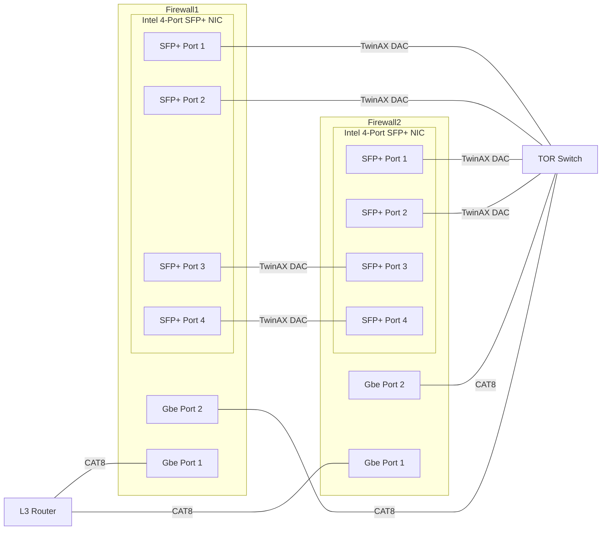
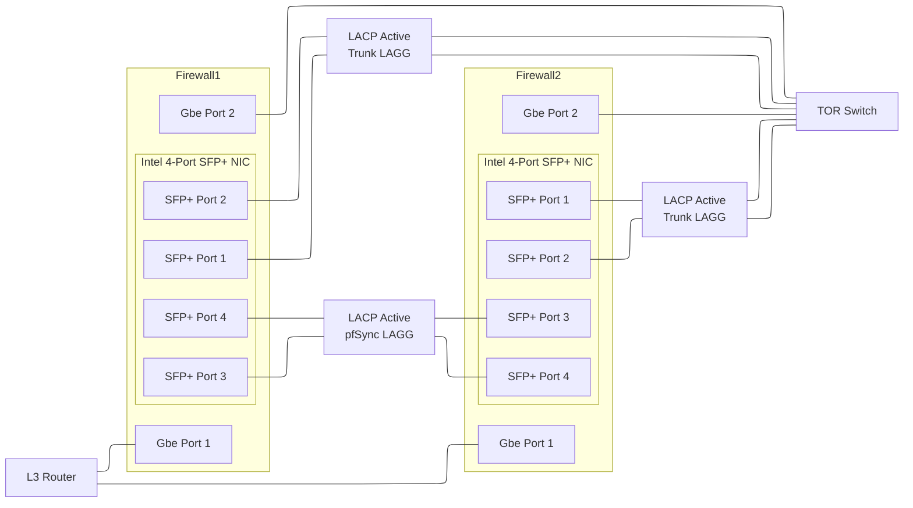
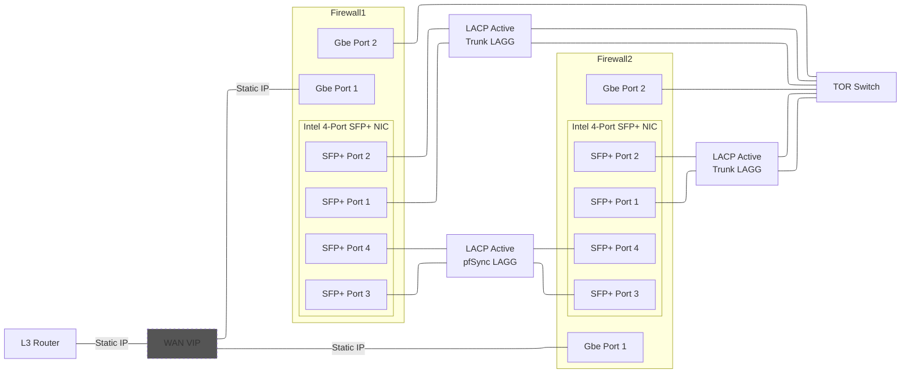

# OPNsense Firewall Connectivity

## Table of Contents

* [TBD](#)

## Physical Connectivity

| Device     | Connection | Purpose    | Description |
|-|-|-|-|
| Firewall 1 | CAT8       | Router     | 1Gbps CAT8 connection to Layer-3 Router |
| Firewall 1 | CAT8       | Management | 1Gbps CAT8 connection to TOR Switch |
| Firewall 1 | TwinAX DAC | LAN Trunk  | Two 10Gbit TwinAX DACs from 4-port Intel NIC to TOR Switch |
| Firewall 1 | TwinAX DAC | pfSync     | Two 10Gbit TwinAX DACs from 4-port Intel NIC to 4-port Intel NIC of 2nd Firewall |
| Firewall 2 | CAT8       | Router     | 1Gbps CAT8 connection to Layer-3 Router |
| Firewall 2 | CAT8       | Management | 1Gbps CAT8 connection to TOR Switch |
| Firewall 2 | TwinAX DAC | LAN Trunk  | Two 10Gbit TwinAX DACs from 4-port Intel NIC to TOR Switch |
| Firewall 2 | TwinAX DAC | pfSync     | Two 10Gbit TwinAX DACs from 4-port Intel NIC to 4-port Intel NIC of 1st Firewall |

## Layer-2 Connectivity

**WIP: Had to call it quits before finishing this one so far**

## Layer-3 Connectivity

**WIP: Had to call it quits before finishing this one so far**

