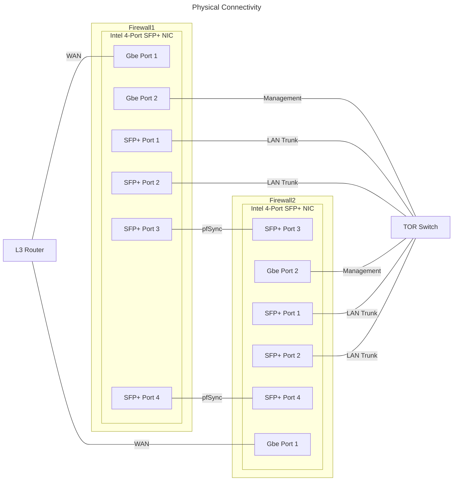

# OPNsense

## Physical Connectivity



| Device     | Purpose    | Description |
|-|-|-|
| Firewall 1 | Router     | 1Gbps CAT8 connection to Layer-3 Router |
| Firewall 1 | Management | 1Gbps CAT8 connection to TOR Switch |
| Firewall 1 | LAN Trunk  | Two 10Gbit TwinAX DACs from 4-port Intel NIC to TOR Switch |
| Firewall 1 | pfSync     | Two 10Gbit TwinAX DACs from 4-port Intel NIC to 4-port Intel NIC of 2nd Firewall |
| Firewall 2 | Router     | 1Gbps CAT8 connection to Layer-3 Router |
| Firewall 2 | Management | 1Gbps CAT8 connection to TOR Switch |
| Firewall 2 | LAN Trunk  | Two 10Gbit TwinAX DACs from 4-port Intel NIC to TOR Switch |
| Firewall 2 | pfSync     | Two 10Gbit TwinAX DACs from 4-port Intel NIC to 4-port Intel NIC of 1st Firewall |

## System -> Access -> Users

* Create personal account
  * Username: `<first>.<last>` (e.g. `bob.smith`)
  * Full name: `<first> <last>` (e.g. `Bob Smith`)
  * Email: `<email address>` (e.g. `bob.smith@bob-smith.com`)
  * Comment: `Admin account for <first> <last>` (e.g. `Admin account for Bob Smith`)
  * Login shell: `/sbin/nologin`
  * Group Memberships
    * Member Of: `admins`

* Disable `root` account after personal account added to `admins` and tested above

* _(HA Only)_ Add `pfsync` account
  * Username: `pfsync`
  * Full name: `PFSYNC User`
  * Email: `<administrative email address>` (e.g. `bob.smith@bob-smith.com`)
  * Comment: `Used for synchronizing configuration and state information between Primary and Backup`
  * Login shell: `/sbin/nologin`
  * Effective Privileges
    * Type: `GUI`
    * Name: `XMLRPC Library`

### Unbound DNS

/usr/local/etc/unbound.opnsense.d/custom-config.conf
```
cache-max-negative-ttl: 1
```

* https://forum.opnsense.org/index.php?topic=23929.msg116959#msg116959

#### Overrides

| Hostname | Domain    | Type | Value | Description |
|-|-|-|-|-|
| k8s-cp01        | home.arpa         | A    | 192.168.x.x | Kubernetes Production Cluster - Control Plane Node 01               |
| k8s-cp02        | home.arpa         | A    | 192.168.x.x | Kubernetes Production Cluster - Control Plane Node 02               |
| k8s-cp03        | home.arpa         | A    | 192.168.x.x | Kubernetes Production Cluster - Control Plane Node 03               |
| k8s-wk01        | home.arpa         | A    | 192.168.x.x | Kubernetes Production Cluster - Data Plane Node 01                  |
| k8s-wk02        | home.arpa         | A    | 192.168.x.x | Kubernetes Production Cluster - Data Plane Node 02                  |
| talos-endpoints | home.arpa         | A    | 192.168.x.x | Kubernetes Production Cluster - Load balanced Talos Endpoints       |
| control-plane   | home.arpa         | A    | 192.168.x.x | Kubernetes Production Cluster - Load balanced Kubernetes API Server |
| k8s-cp01        | staging.home.arpa | A    | 192.168.x.x | Kubernetes Staging Cluster - Control Plane Node 01                  |
| k8s-cp02        | staging.home.arpa | A    | 192.168.x.x | Kubernetes Staging Cluster - Control Plane Node 02                  |
| k8s-cp03        | staging.home.arpa | A    | 192.168.x.x | Kubernetes Staging Cluster - Control Plane Node 03                  |
| k8s-wk01        | staging.home.arpa | A    | 192.168.x.x | Kubernetes Staging Cluster - Data Plane Node 01                     |
| k8s-wk02        | staging.home.arpa | A    | 192.168.x.x | Kubernetes Staging Cluster - Data Plane Node 02                     |
| talos-endpoints | staging.home.arpa | A    | 192.168.x.x | Kubernetes Staging Cluster - Load balanced Talos Endpoints          |
| control-plane   | staging.home.arpa | A    | 192.168.x.x | Kubernetes Staging Cluster - Load balanced Kubernetes API Server    |
